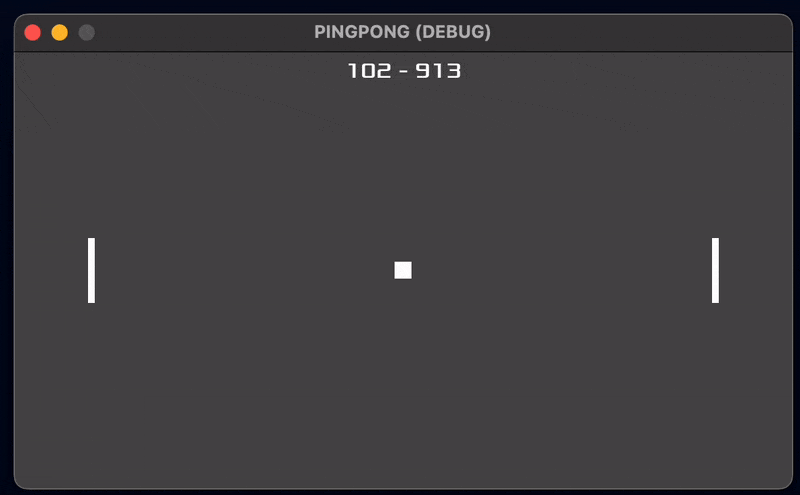

# Reinforcement Learning with Python, scikit-learn, Godot, and C#

## Project Overview

This GitHub repository is dedicated to the integration of Reinforcement Learning (RL) using Python and scikit-learn with the Godot game engine using C#. This project aims to demonstrate how to leverage RL techniques to create intelligent agents within the Godot game environment. By combining the powerful RL capabilities of scikit-learn with the game development potential of Godot, you can create interactive and adaptive game experiences.



The project uses vanilla crossentropy(CE) method for policy approximated by a neural network. For RL, it boild down to Repeat:

* Generate N games
* Take M best
* Fit to those M best samples

## Table of Contents

- [Getting Started](#getting-started)
  - [Prerequisites](#prerequisites)
  - [Installation](#installation)
- [Usage](#usage)
- [Contributing](#contributing)
- [License](#license)

## Getting Started

### Prerequisites

Before you begin, ensure you have met the following requirements:

- Python 3.x installed on your system.
- [scikit-learn](https://scikit-learn.org/stable/install.html) library installed.
- [Godot Engine](https://godotengine.org/) installed on your machine.
- Basic knowledge of Python, scikit-learn, C#, and the Godot engine.

### Installation

1. Clone this GitHub repository to your local machine:

   ```bash
   git clone https://github.com/your-username/rl-godot.git
   ```

2. Open the `godot` folder in the Godot Engine editor.

3. Start exploring the examples provided in the `godot` directory to understand how to integrate Python's RL logic with Godot using C# scripts.

## Usage

1. **Setting up the Python Environment**: First, set up your Python environment:
```bash
cd rl_server
python3 -m venv venv
source venv/bin/activate
pip install -r requirements.txt
python3 main.py
```
You can touch the code in Bot class to change the algorithm. 

2. **Integrating with Godot**: In the `rl_client` folder, you'll find example Godot projects and C# scripts that demonstrate how to interface with the Python RL agents. You can use these examples as a starting point for your own Godot projects.

3. **Testing and Iterating**: Experiment with your RL agents within the Godot environment. Tweak the integration code and the RL algorithms to achieve the desired behavior for your game.

## Contributing

Contributions to this project are welcome! If you have any ideas, bug fixes, or improvements, please open an issue or submit a pull request.

## License

This project is licensed under the MIT License - see the [LICENSE](LICENSE) file for details.